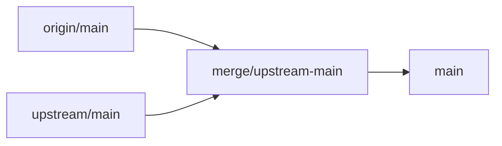

# Upstream merge playbook (AI-oriented)

This document is a step-by-step guide for syncing this fork with upstream
[xai-org/grok-build](https://github.com/xai-org/grok-build). Follow it
verbatim when performing automated upstream merges.

## Fork purpose — keep upstream's core intact

**This fork changes upstream as little as possible.** It exists for one
reason: to let third-party models (DeepSeek, OpenRouter, any OpenAI-compatible
API) run reliably on the upstream agent/TUI core with Bring Your Own Key
(BYOK) configuration — plus a few small TUI ergonomics — and to trim what a
personal BYOK fork doesn't need (billing/paywall, product telemetry).
Everything else is taken from upstream exactly as shipped.

- **KEEP (upstream-owned — never fork):** the agent runtime, TUI, tools, core
  features, module layout, generated/read-only files. Upstream is the source
  of truth; every sync imports its changes wholesale.
- **ADAPT (fork-owned — thin layer only):** `~/.thanh` home so BYOK
  `config.toml` is read; model config parsing (`input_modalities`); text-only
  image stripping; BYOK auth/sampling; plan-approval `g` run-as-goal;
  plan-approval `/model` picker on top of the overlay; a small set of TUI
  ergonomics (`/clear`, `/new`, task-list expansion).
- **TRIM (fork-owned — hide/remove grok.com product chrome this fork does
  not need):** consumer paywall (already stripped in `subscription.rs`, gate
  chokepoint kept); Privacy (`/privacy`, coding-data banner, settings row);
  grok.com usage-limit / `/usage` / `/cost` / upgrade CTAs / announcements;
  product telemetry (`xai-grok-telemetry` — Mixpanel, Sentry, OTel). Hide at
  chokepoints after each sync — do not delete whole upstream modules.
- **NEVER:** reimplement upstream features, redesign upstream UI, restructure
  upstream modules, or carry features that only this fork would maintain.

**Scope test — a change belongs in this fork only if it is one of:**

1. A BYOK / third-party-model adaptation (including the
   [must-not-regress surfaces](#must-not-regress-core-surfaces)).
2. A small TUI ergonomic improvement.
3. A trim — hide/remove grok.com product chrome this fork doesn't need
   (billing, Privacy, usage limits, announcements, telemetry, …) — or a
   genuine bug fix that upstream hasn't accepted yet.

Anything else belongs upstream, not here.

**Implementer spec for the v1.0.14 fallout (home, run-as-goal, model
picker z-order, Privacy / usage-limit trims) lives in
[`docs/post-merge-core-fix.md`](docs/post-merge-core-fix.md).** Follow that
file to restore the layer; this playbook is what the next merge must not
drop.

**Pull everything, adapt after.** When upstream ships new features, merge them
wholesale — do **not** pre-filter or pre-adapt. Grok's own models are
OpenAI-compatible, so new upstream features keep working with BYOK models.
BYOK adaptation and trimming happen afterwards, in the same pass that re-applies
the fork layer.

## Must-not-regress core surfaces

Surfaces A–C **are** the fork (they must still work). Surface D is a removal
that must stay removed. The v1.0.14 merge (`692cb182`) dropped A–C because
the marker grep only covered `input_modalities` / `ModelByok`. Do not merge
to `main` until each row below is green.

### A — BYOK reads `~/.thanh/config.toml`

- **User:** puts `[model.*]` / `[model_providers.*]` in `~/.thanh/config.toml`.
- **Must remain true:** default user home is `~/.thanh`, never upstream
  `~/.grok`. `$GROK_HOME` still overrides. `thanh models` lists those models.
- **Source of truth:** `crates/codegen/xai-dirs/src/lib.rs` —
  `grok_home_in` joins `".thanh"`. Keep upstream's `GrokHomeSource`,
  `home_dir()`, `resolve_grok_home_with_source()`; only the directory name is
  fork-owned. `xai-fast-worktree` already delegates here.
- **Do not** dual-read `~/.grok` and `~/.thanh`. Do not rewrite project-level
  `.grok/` (workspace config, agents, hooks).
- **Marker / test:** `join(".thanh")` in `xai-dirs`;
  `default_grok_home_has_no_verbatim_prefix` asserts `ends_with(".thanh")`.
  `rg 'join\("\.grok"\)' crates/codegen/xai-dirs/src/lib.rs` must be empty.

### B — Plan approval `g` run as goal

- **User:** parks a plan, presses `g` (or clicks `g run as goal`).
- **Must remain true:** pager sends wire outcome `"approved_as_goal"`. Shell
  does **not** map that string to `Cancelled` (request-changes). Plan mode
  exits and a goal is seeded with the approved plan body
  (`GoalTracker::seed_plan`). Same path as `/goal --plan` / `/goal --from-plan`.
- **Chain:** `PlanApprovalViewState::send_approved_as_goal` →
  `PlanApprovalOutcome::ApprovedAsGoal` →
  `setup_goal(..., Some(GoalPlanSource::Content(plan)))` → `seed_plan`.
- **Files:** `xai-grok-shell/.../tool_calls.rs` (`PlanApprovalOutcome`,
  `ResumeAction::LeaveAndStartGoal`, mid-turn + resume),
  `goal.rs` (`setup_goal` third arg + `read_goal_plan_source`),
  `slash_commands.rs` (`GoalPlanSource`, `parse_goal_args`). Pager send path
  (`plan.rs`, `plan_approval_view.rs`, `viewer.rs`) is already intact.
- **Markers:** `ApprovedAsGoal`, `approved_as_goal`, `GoalPlanSource`,
  `LeaveAndStartGoal`.
- **Tests:** `resume_approved_as_goal_seeds_goal_with_plan`,
  `outcome_from_response` maps `"approved_as_goal"`,
  `goal_set_from_plan_flag_parses`,
  `approve_as_goal_sends_goal_outcome_with_freeform_notes`.

### C — Select model while the plan overlay is open (picker not covered)

- **User:** with a parked plan, types `/model` (or `Ctrl+M` / command palette).
- **Must remain true:** slash `/` on the preview starts a command (search
  stays on `f`); a complete `/model <id>` runs and **leaves the overlay**
  for `a`/`g`; the model list / ArgPicker paints **on top of** the plan,
  not under it and not instead of it.
- **Z-order:** draw `line_viewer` (plan) first; then slash/file/history
  dropdowns; then `active_modal` (ArgPicker). Do not skip the plan when a
  modal is open. Do not paint the plan after the dropdown.
- **Files:** `agent_view/render.rs` (draw order), `agent_view/plan.rs`
  (slash-on-Enter), `agent_view/viewer.rs` (bare `/`),
  `agent_view/input.rs` (`try_plan_overlay_agent_action`).
- **Tests:** `model_picker_during_plan_approval`,
  `plan_preview_slash_starts_command_on_prompt`, plus a render test that
  picker cells survive a frame with both plan overlay and ArgPicker/slash
  open. See [`docs/post-merge-core-fix.md`](docs/post-merge-core-fix.md).

### D — Trim grok.com product chrome (Privacy, usage limits, …)

Not a user-facing "feature to keep" — a **removal that must stay removed**.
After every sync, re-hide:

| Surface | What the user must not see | Chokepoint |
|---------|----------------------------|------------|
| Privacy | `/privacy`, "Help improve Grok" banner, Settings → coding-data sharing | `privacy_banner_should_show` always false; hide `PrivacyCommand`; hide `coding_data_sharing` row |
| Usage limits | `/usage`, `/cost`, grok.com quota/credit bar, SuperGrok upgrade CTAs | `usage_command_visible = false` fork-wide; do not restore billing bars |
| Announcements | Product promo banner, `/announcements` | `has_session_announcements` / `visible()` false; skip remote apply |
| Paywall | Free→paid gate UI | Keep current `subscription.rs` (gate chokepoint only, no consumer deferral) |
| Telemetry | Mixpanel / Sentry / product OTel | Target: `xai-grok-telemetry` wiring in `pager-bin` |

**Keep** `/context` (context-window tokens) and `/session-info`. Those are
useful on BYOK. Hide grok.com *limits*, not local session facts.

## Remotes

| Remote | Repository | Role |
|--------|------------|------|
| `origin` | `weseegod/thanh` | This fork — push here |
| `upstream` | `xai-org/grok-build` | Source of truth for core |

Setup (if `upstream` is missing):

```bash
git remote add upstream https://github.com/xai-org/grok-build
git fetch --all
```

## Standard merge workflow

1. Ensure a clean working tree on `main`:

   ```bash
   git checkout main
   git status   # must be clean
   ```

2. Create a merge branch. If `merge/upstream-main` already exists from a
   previous sync, re-point it at `main` instead of creating anew — its old
   tip is normally already an ancestor of `main`, so nothing is lost:

   ```bash
   git checkout -B merge/upstream-main main
   ```

3. Fetch and merge upstream (fetch first — never merge a stale ref):

   ```bash
   git fetch upstream
   git merge upstream/main
   ```

4. Resolve conflicts using the rules in [Conflict resolution](#conflict-resolution).
   The merge brings upstream **in full** — all new features arrive, so do not
   filter features out mid-merge; fork ADAPT/TRIM changes are re-applied on
   top afterwards.

5. Verify the build (fast `cargo check` pre-gate first, then the slow full
   build — see [Post-merge verification](#post-merge-verification)):

   ```bash
   cargo check -p xai-grok-shell -p xai-grok-pager -p xai-grok-sampling-types
   ./build.sh
   ```

6. Merge into `main` (direct delivery):

   ```bash
   git checkout main
   git merge merge/upstream-main
   ```

   Alternative — **PR delivery** (use when the user wants review before
   `main` moves; see [Aug 2026 sync #2](#reference-aug-2026-syncs)):

   ```bash
   git push origin merge/upstream-main
   gh pr create -R <fork> --base main --head merge/upstream-main
   # merge via GitHub, then update local main:
   git checkout main && git pull
   ```

7. Push `main` (only when the user explicitly asks):

   ```bash
   git push origin main
   ```

8. **Bump the fork version and publish a release** (see
   [Release & versioning](#release--versioning)) — **do this after every
   sync** so `thanh update` (Ctrl+U) on all machines picks up the new
   binaries (only skip if the user explicitly says no release):

   ```bash
   scripts/publish_release.sh
   ```

   The script bumps `xai-grok-version` + `xai-grok-pager-bin` (+ `Cargo.lock`),
   tags `vX.Y.Z`, builds `thanh` **locally** via `./build.sh` for the current
   platform, and publishes the GitHub Release with the local binary + `stable`/
   `alpha` pointers. **There is no CI** — the fork builds and releases from the
   machine running the script (needs `gh` installed + authenticated). Before
   closing out the sync, confirm the release + `stable` pointer are live
   (`gh release view vX.Y.Z`). To ship other platforms, build on each machine
   and `gh release upload vX.Y.Z thanh-...-<os>-<arch>`.

**Strategy:** always **merge** `upstream/main` into a branch off fork `main`.
Do **not** rebase fork commits onto upstream — that drops fork history and
makes BYOK customizations harder to track.

**Pull everything, adapt after.** When upstream ships new features, merge them
wholesale — do **not** pre-filter or pre-adapt. Grok's own models are
OpenAI-compatible, so new upstream features keep working with BYOK models.
BYOK adaptation and trimming happen afterwards, in the same pass that re-applies
the fork layer.



## Fork-owned inventory

These paths contain fork customizations. Preserve them during merges.

| Category | Paths | Rule |
|----------|-------|------|
| Fork-only files | `build.sh`, `docs/byok-models.md`, `docs/post-merge-core-fix.md` | Never delete; keep fork version |
| Fork release pipeline | `scripts/publish_release.sh` (self-build via `./build.sh`; **no CI** — `.github/` is removed) | Never delete; keep fork-owned |
| Self-update feed (`thanh`) | `crates/codegen/xai-grok-update/src/version.rs`, `auto_update.rs`, `crates/codegen/xai-grok-config/src/paths.rs`, `crates/codegen/xai-fast-worktree/src/db/mod.rs` (`resolve_grok_home`) | Keep fork feed (`weseegod/thanh` releases), fork home `~/.thanh` (default in `default_grok_home()`/`resolve_grok_home()`, never upstream's `~/.grok`), `thanh` managed binary name (`~/.thanh/bin/thanh`, assets `thanh-<ver>-<os>-<arch>`), `version-thanh.json` cache, single-link swap (never touch `bin/grok`/`bin/agent`) |
| User home (`~/.thanh`) | `crates/codegen/xai-dirs/src/lib.rs` (`grok_home_in`) | **Single source of truth.** Upstream rewrites this file every sync (`GrokHomeSource`, `home_dir()`). Keep those APIs; re-apply `.join(".thanh")`. Never take upstream's `.join(".grok")` wholesale. |
| Version lockstep | `crates/codegen/xai-grok-version/Cargo.toml`, `crates/codegen/xai-grok-pager-bin/Cargo.toml` | Keep fork version; bump after every sync (see [Release & versioning](#release--versioning)) |
| BYOK model config | `crates/codegen/xai-grok-shell/src/agent/config.rs`, `config_model_override_parse.rs`, `models.rs` | Keep fork `input` / `input_modalities` parsing and text-only capability checks |
| Image stripping | `crates/codegen/xai-grok-sampling-types/src/conversation.rs`, `types.rs`, `crates/codegen/xai-grok-shell/src/session/compaction.rs`, `acp_session_impl/turn.rs`, `helpers/full_replace_compaction.rs` | Keep `strip_image_parts_for_text_only` and all call sites |
| BYOK auth/sampling | `crates/codegen/xai-grok-shell/src/session/acp_session.rs`, `acp_session_impl/sampler_turn.rs`, `acp_session_impl/spawn.rs`, `crates/codegen/xai-grok-sampler/src/client.rs`, `crates/codegen/xai-grok-shell/src/remote/client.rs` | Keep BYOK auth memo; do not refresh session tokens against third-party endpoints |
| BYOK goal evaluator | `crates/codegen/xai-grok-shell/src/session/acp_session_impl/goal.rs`, `goal_evaluator.rs` | Keep preferred-model goal-evaluator logic (`effective_suggest_model` from pin, fallback to active) and `GOAL_EVALUATOR_TIMEOUT` guard (re-add const if upstream removes it) |
| Fork TUI UX | `crates/codegen/xai-grok-pager/src/slash/commands/clear.rs`, `new.rs`, `views/turn_status.rs`, `views/tasks_pane.rs`, related `agent_view/` and `dispatch/` changes | Keep fork UX; merge upstream structural refactors around them |
| Plan approve-as-goal | `xai-grok-shell/.../tool_calls.rs` (`PlanApprovalOutcome::ApprovedAsGoal`, `ResumeAction::LeaveAndStartGoal`), `goal.rs` (`setup_goal` + `read_goal_plan_source`), `slash_commands.rs` (`GoalPlanSource`, `parse_goal_args`); pager `plan.rs` / `plan_approval_view.rs` / `viewer.rs` | Keep the wire string `"approved_as_goal"` end-to-end. Restore from `499e1d56` onto current files — do not take `tool_calls.rs` wholesale from the old tip. |
| Plan-approval model picker | `xai-grok-pager/.../agent_view/render.rs` (draw order), `plan.rs` (slash-on-Enter), `viewer.rs` (`/` on preview), `input.rs` (`try_plan_overlay_agent_action`) | Plan `line_viewer` first; dropdowns + ArgPicker on top. Overlay stays for `a`/`g`. |
| Fork docs edits | `crates/codegen/xai-grok-pager/docs/user-guide/04-slash-commands.md`, `05-configuration.md`, `11-custom-models.md`, `17-sessions.md`, `20-background-tasks.md`; `docs/post-merge-core-fix.md` | Prefer upstream wording, then re-apply fork additions. Never delete the implementer spec. |
| Trims (hide, don't delete modules) | Privacy: `app_view.rs` `privacy_banner_should_show`, `slash/commands/privacy.rs`, settings `coding_data_sharing`. Usage limits: `slash/commands/usage.rs` `usage_command_visible`. Announcements: `slash/commands/announcements.rs`, `acp_handler/settings.rs`. Paywall: `app/subscription.rs` (gate chokepoint kept). Telemetry: `xai-grok-telemetry` wiring in `pager-bin`. | After every sync take upstream's re-additions first, then re-hide at the chokepoints. Keep `/context` and `/session-info`. |

The table is illustrative, not exhaustive — many more files carry fork
markers (e.g. `xai-grok-pager/src/acp/model_state.rs`, `xai-grok-pager/src/models.rs`,
`xai-grok-shell/src/agent/auth_method.rs`, `model_providers.rs`, `cli_models.rs`,
`xai-grok-memory/src/backend.rs`, `xai-grok-models/default_models.json`). The marker
diff in [Post-merge verification](#post-merge-verification) is the source of truth.

When both sides touch a hot file in non-overlapping hunks, git auto-merges
without a conflict — the fork hunks still need checking. In the Aug 2026
sync #2, 7 inventory files merged that way; the marker diff caught no loss.

## Release & versioning

The fork ships binaries as **`thanh`** (not `grok`) with its own home
**`~/.thanh`** (config, auth, sessions, `bin/`, `downloads/`, caches) so it
runs fully isolated from an official grok install that keeps `~/.grok`.
Release assets on `weseegod/thanh` GitHub Releases are named
`thanh-<version>-<os>-<arch>` (e.g. `thanh-0.2.122-macos-aarch64`), plus
plain-text `stable` / `alpha` channel pointers that the built-in updater
(Ctrl+U / `thanh update`) reads from `releases/latest/download/`.

Rules:

- **Version** is plain 3-part semver, strictly increasing per release — the
  stable channel rejects pre-release targets (`0.2.121-thanh.1` would never
  be considered an update). Keep `xai-grok-version` and `xai-grok-pager-bin`
  lockstepped (they already are, both synced to upstream's current version).
- **After every upstream sync**, bump the version (typically patch
  `1.0.0 → 1.0.1`) and publish: `scripts/publish_release.sh`. It builds
  `thanh` **locally** via `./build.sh` for the machine it runs on (no CI).
  `gh` must be installed and authenticated (`gh auth login`) to create the
  GitHub Release; to ship other platforms, build on each machine and
  `gh release upload vX.Y.Z thanh-...-<os>-<arch>`.
- **Verify the release after publishing**: the `stable`/`alpha` pointers and
  the `thanh-<ver>-<os>-<arch>` assets must exist on the GitHub Release
  before `thanh update` can serve them — check `gh release view vX.Y.Z`.
- The updater's default installer is `internal` (pure HTTP against the fork's
  GitHub Releases); `gh-release` (needs `gh`) is also supported. It manages
  `~/.thanh/bin/thanh` only and never touches grok's `~/.grok` tree.

### Fork commit map

Use `git log upstream/main..origin/main` to see current fork-only commits.
Historical fork commits (reference):

| Commit | Summary |
|--------|---------|
| `f7e1933` | `input_modalities` in model config + BYOK docs |
| `7834d58` | Strip image parts for text-only BYOK models |
| `588bac6` | BYOK model adaptation (sampler, compaction, goal classifier) |
| `aa7516d` | `/clear` command clears TUI texts |
| `5202d9d` | `/new` command keeps same model |
| `641974a` | Click still-running status to expand inline task list |
| `e61c126` | Add `build.sh` to build and install thanh binary |
| `2c0193f` | Fix `build.sh` to auto-install dotslash for `bin/protoc` |
| `b9b61ba` | Add UPSTREAM-MERGE.md playbook + document fork BYOK goal |
| `c2b4b6f` | Stop subagent child sessions when workflow cancel lands |
| `c28b9603` / `bd2e90f9` | Plan `g` run-as-goal + slash `/model` on plan approval (input). Restore after every sync. |
| `692cb182` (v1.0.14) | **Incident:** wholesale upstream merge dropped A/B/C (`xai-dirs` → `~/.grok`, `ApprovedAsGoal` gone, picker z-order). Last good tip: `499e1d56`. Spec: `docs/post-merge-core-fix.md`. |

## Conflict resolution

| Situation | Action |
|-----------|--------|
| Any change not required by BYOK support, small TUI ergonomics, or the trim list | Take **upstream** — it does not belong in the fork |
| File not in fork inventory above | Take **upstream** |
| Fork-only file (`build.sh`, `docs/byok-models.md`, `docs/post-merge-core-fix.md`) | Keep **fork** |
| Shared hot file (`models.rs`, `config.rs`, `compaction.rs`, etc.) | **Combine**: upstream refactor/renames + fork BYOK logic |
| Generated/read-only (`Cargo.toml` workspace root, `SOURCE_REV`) | Take **upstream** |
| Upstream deleted/renamed something the fork touched | Follow **upstream** structure; re-port fork logic into new locations |

Trims (removals) are re-applied **after** the wholesale merge, not decided
during conflict resolution: take upstream's re-additions first, then delete
again (see the inventory TRIM row).

After resolving shared hot files, grep for fork markers:

```bash
MARKER='strip_image_parts_for_text_only|input_modalities|ModelByok|byok|ApprovedAsGoal|approved_as_goal|GoalPlanSource|LeaveAndStartGoal'
rg "$MARKER" --type rust

# Home must be .thanh, never .grok, in the single source of truth:
rg 'join\("\.thanh"\)' crates/codegen/xai-dirs/src/lib.rs
rg 'join\("\.grok"\)' crates/codegen/xai-dirs/src/lib.rs   # must be empty
```

All expected matches must still be present. `xai-dirs` joining `.grok` is an
automatic fail — that is how `~/.thanh/config.toml` stops being read.

### Common upstream structural changes

Upstream monorepo syncs may rename or remove modules. Examples seen in past merges:

- `project_picker/` renamed to `recent_dirs.rs` — follow upstream layout
- `trace_classifier/` removed — do not restore; take upstream deletion

When upstream refactors a file the fork also edited, read both sides and
merge function-by-function rather than picking one side wholesale.

## Post-merge verification

Run all checks before merging to `main`:

```bash
# Fast pre-gate (a few minutes) — run first; the full release build is slow
cargo check -p xai-grok-shell -p xai-grok-pager -p xai-grok-sampling-types
# Full gate (slow) — this is also the self-build path used for releases
./build.sh
```

Verify fork markers survived the merge — diff marker lines between the
pre-merge `main` tip and the merged tree. Identical output means fork logic
is fully preserved:

```bash
MARKER='strip_image_parts_for_text_only|input_modalities|ModelByok|ApprovedAsGoal|approved_as_goal|GoalPlanSource|LeaveAndStartGoal'
git grep -n "$MARKER" <main-tip> -- '*.rs' | sed 's/<main-tip>://' | sort > /tmp/pre.txt
git grep -n "$MARKER" -- '*.rs' | sort > /tmp/post.txt
diff /tmp/pre.txt /tmp/post.txt   # empty = preserved

rg "$MARKER|byok" --type rust
rg 'join\("\.thanh"\)' crates/codegen/xai-dirs/src/lib.rs
rg 'join\("\.grok"\)' crates/codegen/xai-dirs/src/lib.rs   # must be empty
```

Note: `git grep -c` and `rg -c` both count matching lines but their output
formats differ — use `git grep -n` (not `-c`) when diffing pre vs post.

Targeted tests (must pass before `main`; full commands in
[`docs/post-merge-core-fix.md`](docs/post-merge-core-fix.md) § Tests):

```bash
cargo test -p xai-dirs --lib
cargo test -p xai-grok-shell --lib \
  outcome_from_response_maps_known_and_fails_closed \
  resume_action_maps_each_outcome \
  resume_approved_as_goal_seeds_goal_with_plan \
  goal_set_from_plan_flag_parses
cargo test -p xai-grok-pager --lib \
  model_picker_during_plan_approval \
  plan_preview_slash_starts_command_on_prompt \
  approve_as_goal_sends_goal_outcome_with_freeform_notes
```

Manual checks:

- [ ] `docs/byok-models.md` and `docs/post-merge-core-fix.md` exist
- [ ] `build.sh` exists and is executable
- [ ] `./build.sh` prints a version (e.g. `thanh 0.2.x`)
- [ ] Fork markers preserved: `strip_image_parts_for_text_only|input_modalities|ModelByok|byok|ApprovedAsGoal|GoalPlanSource|LeaveAndStartGoal`, plus `weseegod/thanh`, `version-thanh.json`, `~/.thanh`, `bin/thanh`
- [ ] `xai-dirs` default home is `~/.thanh` (`ends_with(".thanh")`)
- [ ] `thanh models` sees models from `~/.thanh/config.toml` (not `~/.grok/config.toml`)
- [ ] Plan approval footer still has `g run as goal`; `g` seeds a goal (not "request changes")
- [ ] With a parked plan, `/model` or `Ctrl+M` shows the picker **on top of** the plan; overlay stays for `a`/`g`
- [ ] No Privacy banner, no `/privacy`, no Settings coding-data row
- [ ] No `/usage` / `/cost`, no grok.com quota/upgrade CTA, no announcement promo
- [ ] `/context` and `/session-info` still work
- [ ] No conflict markers left in source (`rg -n '^(<<<<<<<|=======|>>>>>>>)'` — match at line start only; mid-line matches in string literals are false positives)
- [ ] Release published after the sync (when binaries are shipped): `gh release view vX.Y.Z` shows the `stable` pointer + `thanh-<ver>-<os>-<arch>` assets

## Anti-patterns

- Do **not** force-push `main`
- Do **not** rebase fork commits onto upstream
- Do **not** delete `build.sh`, `docs/byok-models.md`, or `docs/post-merge-core-fix.md`
- Do **not** commit API keys or real credentials from `~/.thanh/config.toml`
- Do **not** take upstream's `xai-dirs` `.join(".grok")` wholesale
- Do **not** drop `ApprovedAsGoal` because the wire string is "unknown" to upstream (unknown maps to `Cancelled` = request-changes)
- Do **not** paint `line_viewer` after slash dropdowns / ArgPicker (covers `/model`)
- Do **not** dual-read `~/.grok` and `~/.thanh`
- Do **not** re-show Privacy, `/usage` limits, announcements, or the consumer paywall
- Do **not** add fork-only features unrelated to BYOK support, small TUI
  ergonomics, or trimming — propose them upstream instead
- Do **not** pre-filter upstream features during a merge — bring everything
  in first, then adapt/trim
