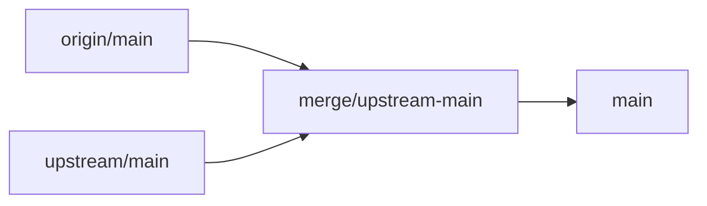

# Upstream merge playbook (AI-oriented)

This document is a step-by-step guide for syncing this fork with upstream
[xai-org/grok-build](https://github.com/xai-org/grok-build). Follow it
verbatim when performing automated upstream merges.

## Project goal

This repository is a **BYOK-focused fork** of Grok Build. Upstream owns the
agent runtime, TUI, tools, and core features. This fork keeps upstream core
as-is and adds a thin customization layer so third-party models (DeepSeek,
OpenRouter, etc.) work reliably with Bring Your Own Key (BYOK) configuration.

Do **not** reimplement upstream features. Extend only where third-party models
need different behavior (model config parsing, text-only image handling, BYOK
auth, and small TUI ergonomics).

## Remotes

| Remote | Repository | Role |
|--------|------------|------|
| `origin` | `weseegod/xgrok` | This fork — push here |
| `upstream` | `xai-org/grok-build` | Source of truth for core |

Setup (if `upstream` is missing):

```bash
git remote add upstream https://github.com/xai-org/grok-build
git fetch --all
```

## Standard merge workflow

1. Ensure a clean working tree on `main`:

   ```bash
   git checkout main
   git status   # must be clean
   ```

2. Create a merge branch:

   ```bash
   git checkout -b merge/upstream-main
   ```

3. Merge upstream:

   ```bash
   git merge upstream/main
   ```

4. Resolve conflicts using the rules in [Conflict resolution](#conflict-resolution).

5. Verify the build:

   ```bash
   ./build.sh
   ```

6. Merge into `main`:

   ```bash
   git checkout main
   git merge merge/upstream-main
   ```

7. Push (only when the user explicitly asks):

   ```bash
   git push origin main
   ```

**Strategy:** always **merge** `upstream/main` into a branch off fork `main`.
Do **not** rebase fork commits onto upstream — that drops fork history and
makes BYOK customizations harder to track.



## Fork-owned inventory

These paths contain fork customizations. Preserve them during merges.

| Category | Paths | Rule |
|----------|-------|------|
| Fork-only files | `build.sh`, `docs/byok-models.md` | Never delete; keep fork version |
| BYOK model config | `crates/codegen/xai-grok-shell/src/agent/config.rs`, `config_model_override_parse.rs`, `models.rs` | Keep fork `input` / `input_modalities` parsing and text-only capability checks |
| Image stripping | `crates/codegen/xai-grok-sampling-types/src/conversation.rs`, `types.rs`, `crates/codegen/xai-grok-shell/src/session/compaction.rs`, `acp_session_impl/turn.rs`, `helpers/full_replace_compaction.rs` | Keep `strip_image_parts_for_text_only` and all call sites |
| BYOK auth/sampling | `crates/codegen/xai-grok-shell/src/session/acp_session.rs`, `acp_session_impl/sampler_turn.rs`, `acp_session_impl/spawn.rs`, `crates/codegen/xai-grok-sampler/src/client.rs`, `crates/codegen/xai-grok-shell/src/remote/client.rs` | Keep BYOK auth memo; do not refresh session tokens against third-party endpoints |
| Fork TUI UX | `crates/codegen/xai-grok-pager/src/slash/commands/clear.rs`, `new.rs`, `views/turn_status.rs`, `views/tasks_pane.rs`, related `agent_view/` and `dispatch/` changes | Keep fork UX; merge upstream structural refactors around them |
| Fork docs edits | `crates/codegen/xai-grok-pager/docs/user-guide/04-slash-commands.md`, `05-configuration.md`, `11-custom-models.md`, `17-sessions.md`, `20-background-tasks.md` | Prefer upstream wording, then re-apply fork additions |

### Fork commit map

Use `git log upstream/main..origin/main` to see current fork-only commits.
Historical fork commits (reference):

| Commit | Summary |
|--------|---------|
| `f7e1933` | `input_modalities` in model config + BYOK docs |
| `7834d58` | Strip image parts for text-only BYOK models |
| `588bac6` | BYOK model adaptation (sampler, compaction, goal classifier) |
| `aa7516d` | `/clear` command clears TUI texts |
| `5202d9d` | `/new` command keeps same model |
| `641974a` | Click still-running status to expand inline task list |
| `e61c126` | Add `build.sh` to build and install xgrok binary |
| `2c0193f` | Fix `build.sh` to auto-install dotslash for `bin/protoc` |

## Conflict resolution

| Situation | Action |
|-----------|--------|
| File not in fork inventory above | Take **upstream** |
| Fork-only file (`build.sh`, `docs/byok-models.md`) | Keep **fork** |
| Shared hot file (`models.rs`, `config.rs`, `compaction.rs`, etc.) | **Combine**: upstream refactor/renames + fork BYOK logic |
| Generated/read-only (`Cargo.toml` workspace root, `SOURCE_REV`) | Take **upstream** |
| Upstream deleted/renamed something the fork touched | Follow **upstream** structure; re-port fork logic into new locations |

After resolving shared hot files, grep for fork markers:

```bash
rg "strip_image_parts_for_text_only|input_modalities|ModelByok|byok" --type rust
```

All expected matches must still be present.

### Common upstream structural changes

Upstream monorepo syncs may rename or remove modules. Examples seen in past merges:

- `project_picker/` renamed to `recent_dirs.rs` — follow upstream layout
- `trace_classifier/` removed — do not restore; take upstream deletion

When upstream refactors a file the fork also edited, read both sides and
merge function-by-function rather than picking one side wholesale.

## Post-merge verification

Run all checks before merging to `main`:

```bash
./build.sh
cargo check -p xai-grok-shell -p xai-grok-pager -p xai-grok-sampling-types
rg "strip_image_parts_for_text_only|input_modalities|ModelByok" --type rust
```

Manual checks:

- [ ] `docs/byok-models.md` exists
- [ ] `build.sh` exists and is executable
- [ ] `./build.sh` prints a version (e.g. `xgrok 0.2.x`)
- [ ] No conflict markers left in source (`rg '<<<<<<<'`)

## Anti-patterns

- Do **not** force-push `main`
- Do **not** rebase fork commits onto upstream
- Do **not** delete `build.sh` or `docs/byok-models.md`
- Do **not** commit API keys or real credentials from `~/.grok/config.toml`

## Reference: Aug 2026 merge

- 3 upstream commits ("Synced from monorepo") merged with **zero conflicts**
- Build verified: `xgrok 0.2.120` via `./build.sh`
- Fork had 8 commits ahead of upstream at merge time
